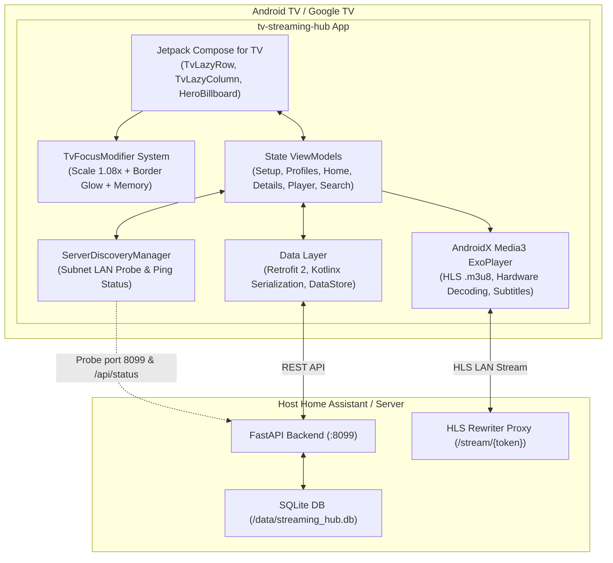

# Streaming Hub for Android TV 📺🎬

[](https://developer.android.com/tv)
[](https://kotlinlang.org/)
[](https://developer.android.com/jetpack/compose/tv)
[](https://developer.android.com/media/media3)
[](LICENSE)

Applicazione nativa per **Android TV** e **Google TV** progettata per interfacciarsi con il backend multimediale di [**ha-streaming-hub**](https://github.com/JMaroz/ha-streaming-hub) (Add-on Home Assistant).
Offre un'esperienza "10-foot UI" fluida, cinematografica e ottimizzata per l'uso esclusivo tramite **telecomando (D-pad)** con focus management ad alto contrasto.

---

## 🌟 Caratteristiche Principali

- 📡 **Rilevamento Automatico del Server (Auto-Discovery)**: All'avvio effettua la scansione rapida della sottorete locale (porta 8099 / mDNS) verificando automaticamente la connessione con l'endpoint `/api/status`. Supporta anche la configurazione manuale con test di connettività.
- 🎯 **Focus Management Avanzato (10-Foot UI)**:
  - Ingrandimento elastico delle schede (1.08x) con bordo luminoso (*Indigo Glow* `#6366f1`) ed elevazione.
  - Sfondo dinamico ad alta risoluzione (**Dynamic Hero Billboard**) con dissolvenza incrociata al cambio di focus.
  - **Focus Memory**: memorizzazione dell'elemento attivo al ritorno dal player o dalla scheda di dettaglio.
- 🍿 **Profili Famiglia con Filtro Età & PIN**:
  - Selettore profili stile Netflix all'avvio o tramite menu rapido.
  - Filtro automatico del catalogo per classificazione d'età (`T`, `6+`, `14+`, `18+`, `ALL`).
  - Finestra modale con tastierino numerico a video navigabile via telecomando per i profili protetti da PIN genitore.
- ⚡ **Player Video HLS ad Alte Prestazioni (AndroidX Media3 ExoPlayer)**:
  - Riproduzione diretta dei flussi LAN HLS proxy erogati da `ha-streaming-hub` con header anti-blocco già riscritti dal server.
  - OSD (On-Screen Display) con comparsa e scomparsa automatica dopo 3.5 secondi.
  - Salto rapido avanti/indietro di 10 secondi e scrubbing della timeline.
  - Selettore tracce audio multilingua e sottotitoli.
  - Heartbeat automatico del progresso inviato ogni 10 secondi a `/api/history` con sincronizzazione Trakt.tv.
- 📚 **Catalogo Completo & Shelves**:
  - *Continua a guardare*: Barra di avanzamento e ripresa rapida dal punto esatto.
  - *I Tuoi Preferiti*: Lista personalizzata sincronizzata con il server.
  - *Ultimi Arrivi, Film Recenti, Serie TV e Corsie per Genere*.
  - Scheda dettagli estesa con trama, cast, regista, selezione stagioni/episodi e scelta del provider (StreamingCommunity, CB01, ecc.).
- 🎙️ **Ricerca Vocale & Tastiera TV**:
  - Ricerca istantanea con debouncing.
  - Integrazione con l'assistente vocale di Android TV (`RecognizerIntent.ACTION_RECOGNIZE_SPEECH`) premendo il tasto microfono del telecomando.

---

## 🏛️ Architettura del Progetto



---

## 🎮 Mappatura Tasti Telecomando (Remote Control)

| Tasto Telecomando | Schermata Catalogo / Dettagli | Player Video |
|---|---|---|
| **Freccia SU** | Sposta il focus verso la riga superiore o barra di navigazione | Mostra finestra selezione Audio / Sottotitoli |
| **Freccia GIÙ** | Sposta il focus verso la riga inferiore | Mostra controlli OSD |
| **Freccia SINISTRA** | Scorri verso la locandina precedente | Salto indietro di 10 secondi (Rewind) |
| **Freccia DESTRA** | Scorri verso la locandina successiva | Salto in avanti di 10 secondi (Fast Forward) |
| **D-Pad CENTER (OK)** | Seleziona l'elemento evidenziato | Play / Pausa |
| **Tasto INDIETRO (Back)** | Torna alla schermata precedente | Salva progresso ed esce dal player |
| **Tasto MICROFONO** | Avvia la ricerca vocale (nella schermata di ricerca) | - |

---

## 📂 Struttura del Codice Sorgente

```text
tv-streaming-hub/
├── build.gradle.kts                   # Configurazione root Gradle
├── settings.gradle.kts                # Configurazione repository e plugin
├── gradle/
│   ├── libs.versions.toml             # Version Catalog (Kotlin, Compose TV, Media3)
│   └── wrapper/                       # Gradle Wrapper 8.9
├── app/
│   ├── build.gradle.kts               # Configurazione modulo Android TV
│   ├── proguard-rules.pro             # Regole di ottimizzazione R8/Proguard
│   └── src/main/
│       ├── AndroidManifest.xml        # Manifest Android TV (Leanback launcher & banner)
│       ├── res/
│       │   ├── drawable/              # Banner TV 16:9 e icona launcher
│       │   └── values/                # Colori, stringhe e temi TV
│       └── kotlin/it/streaminghub/tv/
│           ├── StreamingHubApp.kt     # Inizializzazione App e cache Coil
│           ├── MainActivity.kt        # Entry point e navigazione TV
│           ├── data/
│           │   ├── api/               # StreamingHubApi, ApiClient, ServerDiscoveryManager
│           │   ├── local/             # AppPreferences (DataStore)
│           │   ├── model/             # DTO Kotlin serializzabili
│           │   └── repository/        # Catalog, Playback, Profile e Favorites
│           ├── player/
│           │   └── VideoPlayerManager.kt # Wrapper AndroidX Media3 ExoPlayer
│           └── ui/
│               ├── theme/             # Tema scuro cinematico (TvMaterial3)
│               ├── components/        # TvFocusModifier, TvPosterCard, TvEpisodeCard, HeroBillboard
│               ├── navigation/        # NavRoutes e AppNavigation
│               ├── setup/             # SetupScreen & SetupViewModel (Autodiscovery)
│               ├── profiles/          # ProfilePickerScreen & ProfileViewModel (PIN)
│               ├── home/              # HomeScreen & HomeViewModel (Shelves & Hero)
│               ├── details/           # DetailsScreen & DetailsViewModel (Stagioni & Sorgenti)
│               ├── player/            # PlayerScreen & PlayerViewModel (OSD)
│               └── search/            # SearchScreen & SearchViewModel (Voice search)
```

---

## 🛠️ Come Compilare ed Eseguire

### Requisiti
- **JDK 17** o superiore.
- **Android SDK** con `compileSdk = 34` (Android 14) e `minSdk = 26` (Android 8.0 Oreo).
- **Android Studio** (Hedgehog o superiore raccomandato).

### Compilazione da Riga di Comando
```bash
# Compilazione dell'APK Debug
./gradlew assembleDebug

# Esecuzione dei controlli di lint
./gradlew lintDebug
```

L'APK generato sarà disponibile in:
`app/build/outputs/apk/debug/app-debug.apk`

### Installazione su Dispositivo Android TV / Box TV
Puoi installare l'APK direttamente tramite `adb`:
```bash
# Connessione all'IP della tua Android TV (abilitando Debug USB/Rete nelle Opzioni Sviluppatore)
adb connect 192.168.1.xxx:5555

# Installazione dell'APK
adb install -r app/build/outputs/apk/debug/app-debug.apk
```

---

## 📄 Licenza

Rilasciato sotto licenza [MIT](LICENSE).
