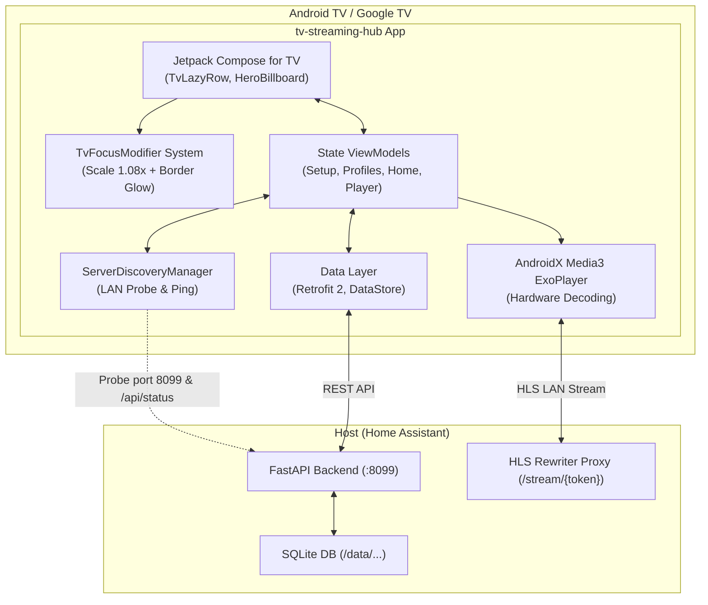

# 📺 Streaming Hub per Android TV & Google TV

[](https://developer.android.com/tv)
[](https://kotlinlang.org/)
[](https://developer.android.com/jetpack/compose/tv)
[](https://developer.android.com/media/media3)
[](LICENSE)

> Un'esperienza multimediale cinematografica, progettata nativamente per schermi di grandi dimensioni.

<!-- Placeholder per uno screenshot dell'app, molto consigliato per i README di app visive -->


**Streaming Hub** è un'applicazione nativa per **Android TV** e **Google TV**, ottimizzata per un'esperienza "10-foot UI" fluida ed elegante. Costruita con le più recenti tecnologie Android (Jetpack Compose for TV, Media3 ExoPlayer), offre un'interfaccia ad alto contrasto concepita per l'uso esclusivo tramite telecomando (D-pad).

> [!IMPORTANT]
> **Requisito Fondamentale:** Questa app funge da client e richiede che il server [**ha-streaming-hub**](https://github.com/JMaroz/ha-streaming-hub) (Add-on per Home Assistant) sia installato, configurato e attivo sulla tua rete locale. Senza il backend in esecuzione, l'applicazione non può funzionare.

---

## 📑 Indice
- [✨ Caratteristiche Principali](#-caratteristiche-principali)
- [🏗️ Architettura del Progetto](#-architettura-del-progetto)
- [🎮 Mappatura Telecomando](#-mappatura-telecomando)
- [📂 Struttura del Codice](#-struttura-del-codice)
- [🚀 Prerequisiti e Installazione](#-prerequisiti-e-installazione)
- [📄 Licenza](#-licenza)

---

## ✨ Caratteristiche Principali

- 📡 **Rilevamento Automatico del Server (Zero-Config)**: Scansione rapida della sottorete locale (porta 8099 / mDNS) con verifica istantanea dell'endpoint `/api/status`. Configurazione manuale supportata come fallback.
- 🎯 **Esperienza Visiva per TV (10-Foot UI)**:
  - Ingrandimento elastico delle schede (1.08x) con bagliore *Indigo Glow* (`#6366f1`) ed elevazione dinamica.
  - **Dynamic Hero Billboard**: sfondo ad alta risoluzione che reagisce e sfuma dinamicamente al cambio di focus.
  - **Focus Memory**: mantiene lo stato di navigazione tornando fluidamente all'ultimo elemento attivo.
- 🍿 **Gestione Profili & Parental Control**:
  - Selezione profilo in stile Netflix (all'avvio o tramite quick menu).
  - Filtro automatico dei contenuti basato su rating (`T`, `6+`, `14+`, `18+`, `ALL`).
  - Protezione con PIN per profili specifici, tramite tastierino numerico ottimizzato per telecomando.
- ⚡ **Player HLS ad Alte Prestazioni (Media3 ExoPlayer)**:
  - Riproduzione hardware-accelerated dei flussi LAN HLS proxy erogati dal server.
  - OSD (On-Screen Display) intelligente con auto-hide (3.5s).
  - Controlli di scrubbing fluidi, selezione tracce audio multilingua e sottotitoli integrati.
  - Sincronizzazione automatica del progresso (heartbeat ogni 10s verso `/api/history`) e integrazione Trakt.tv.
- 📚 **Catalogo Dinamico & Shelves**:
  - Liste personalizzate: *Continua a guardare*, *I Tuoi Preferiti*, *Ultimi Arrivi*, *Trending*.
  - Schede dettaglio arricchite con metadati completi (trama, cast, regista) e selezione intuitiva per stagioni ed episodi.
- 🎙️ **Integrazione Vocale**:
  - Ricerca istantanea (con debouncing) e supporto nativo per l'assistente vocale di Android TV.

---

## 🏗️ Architettura del Progetto

L'applicazione segue i moderni pattern di sviluppo Android (MVVM / Clean Architecture) con una chiara separazione tra la UI reattiva e il Data Layer.



---

## 🎮 Mappatura Telecomando

L'intera interfaccia è ottimizzata per garantire una navigazione fluida e naturale utilizzando unicamente il telecomando della TV.

| Tasto D-Pad | Schermata Catalogo / Dettagli | Player Video (Media3) |
|:---:|---|---|
| **⬆️ SU** | Focus su riga superiore / Nav Bar | Selettore Audio / Sottotitoli |
| **⬇️ GIÙ** | Focus su riga inferiore | Mostra controlli OSD |
| **⬅️ SINISTRA** | Scorri verso sinistra | Salto indietro di 10s (Rewind) |
| **➡️ DESTRA** | Scorri verso destra | Salto in avanti di 10s (Fast Forward) |
| **⏺️ CENTER (OK)** | Seleziona elemento | Play / Pausa |
| **↩️ BACK** | Torna alla schermata precedente | Salva progresso ed esce |
| **🎤 MICROFONO** | Avvia la ricerca vocale | - |

---

## 📂 Struttura del Codice

La codebase è modulata per garantire scalabilità e facile manutenzione:

```text
app/src/main/kotlin/it/streaminghub/tv/
├── data/          # Retrofit API, Modelli DTO, DataStore e Repository (Single Source of Truth)
├── player/        # Wrapper di ExoPlayer per un'integrazione fluida in Compose
└── ui/
    ├── theme/     # Material3 for TV (palette colori, typography, shape)
    ├── components/# Componenti UI riutilizzabili (HeroBillboard, TvPosterCard)
    ├── navigation/# Gestione routing con Navigation Compose
    └── [screens]/ # Feature specifiche (setup, profiles, home, details, player, search)
```

---

## 🚀 Prerequisiti e Installazione

### 1. Prerequisiti di Sistema
- **Backend**: [**ha-streaming-hub**](https://github.com/JMaroz/ha-streaming-hub) installato e in esecuzione.
- **Ambiente di Sviluppo**:
  - JDK 17 o superiore.
  - Android SDK (API 34, Android 14) / `minSdk` 26 (Android 8.0).
  - Android Studio (Hedgehog o versione superiore).

### 2. Compilazione (Build)
Clona la repository ed esegui la build tramite il Gradle Wrapper integrato:
```bash
# Genera l'APK in modalità Debug
./gradlew assembleDebug

# Esegui i controlli di linting
./gradlew lintDebug
```
L'eseguibile compilato si troverà in: `app/build/outputs/apk/debug/app-debug.apk`

### 3. Installazione su TV via ADB
Abilita il **Debug di Rete** o il **Debug USB** dalle *Opzioni Sviluppatore* della tua TV e usa ADB per l'installazione remota:
```bash
# Connettiti alla TV (sostituisci l'IP)
adb connect 192.168.1.xxx:5555

# Installa l'APK
adb install -r app/build/outputs/apk/debug/app-debug.apk
```

---

## 📄 Licenza

Questo progetto è rilasciato sotto la licenza [MIT](LICENSE).
